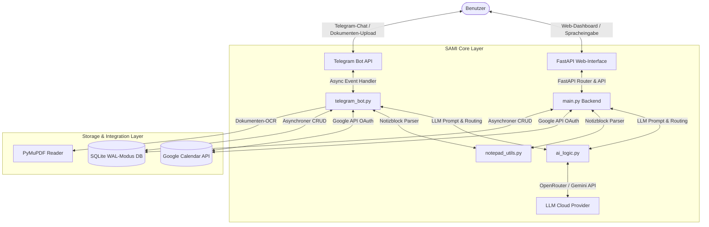

# 🤖 SAMI – Strategic Agentic Multilayer Intelligence: Lumina Personal Assistant Suite

[](https://www.python.org/)
[](https://fastapi.tiangolo.com/)
[](https://www.sqlite.org/)
[](https://developers.google.com/calendar)
[](https://core.telegram.org/bots)

**SAMI (Lumina Personal Assistant Suite)** ist ein hochgradig optimierter, privater KI-Assistent der nächsten Generation. Er vereint ein synchronisiertes **Telegram-Bot-Interface** und ein voll-integriertes, **premium glassmorphes Web-Interface** zu einer nahtlosen Produktivitätszentrale. 

Das System verwaltet eigenständig Ihren Google Kalender, verfügt über ein intelligentes, kontextsensitives Notizblock-System, extrahiert Dokumentendaten aus Bildern sowie PDFs und nutzt ein asynchrones SQLite-Langzeitgedächtnis im WAL-Modus mit unbegrenzter Ausfallsicherheit.

---

## 🌟 Kernkompetenzen & Highlights

* 📅 **Autonomer Google Calendar Manager (`[CALENDAR_EVENT]`)**: Termine über natürliche Sprache abfragen, erstellen, verschieben, anpassen oder löschen. Automatische Time-Slot-Konflikterkennung.
* 📝 **Intelligenter SAMI-Notizblock (`[NOTE_EVENT]`)**: Automatisierte KI-Klassifizierung trennt lose Gedanken/To-Dos von festen Kalenderterminen und leitet sie in den lokalen, tabs-basierten Notizblock.
* 🧠 **SAMI Context Engine (Langzeitgedächtnis)**: SQLite-Datenbank im **WAL-Modus** (Write-Ahead Logging) garantiert parallele, sperrfreie Lese- und Schreibvorgänge unter hoher Polling-Last. Merkt sich Vorlieben und Kontexte dauerhaft.
* 📄 **Multimodale Extraktion & OCR**: Upload von Bildern (Vision) oder PDFs (PyMuPDF) – SAMI extrahiert Termindaten, Absender und Details vollautomatisch und pflegt sie in Ihren Kalender ein.
* 🎙️ **Native Sprachsteuerung & Audio-Player (Web Speech API & MediaRecorder)**: Integrierter Mikrofon-Button im Web-Interface ermöglicht die intuitive Spracheingabe mit gleichzeitiger Audio-Aufnahme. Aufgenommene Sprachmemos werden als **premium abspielbare Sprachnachrichten** mit edel gestalteten, glassmorphen Audio-Playern direkt im Chat-Verlauf gerendert, mitsamt dem transkribierten Text in Kursivschrift darunter.
* 🖥️ **Premium Glassmorphic Web-Interface**:
  * **Ultra-flüssiges Panel-Resizing:** Verzögerungsfreies Ziehen und Verschieben des Trennbalkens zwischen Kalender und Chat zur flexiblen Layout-Größenanpassung (optimiert mit globaler Deaktivierung von Transitions während des Resizing-Vorgangs).
  * **Interactive Selection Highlights:** Aktive Kalendertage leuchten edel auf und bleiben während der Modal-Ansicht markiert.
  * **Erweiterte Tastaturnavigation:** Pfeiltasten (`←` / `→`) für blitzschnellen Monatswechsel, `H`-Taste für Sprung zu "Heute" und `Esc` zum Schließen.
  * Sattes, gestochen scharfes Schriftbild dank optimiertem Hardware-Layer-Antialiasing unter Windows.
* 🔒 **Security First (User-Whitelisting)**: Der Telegram-Bot reagiert exklusiv und manipulationssicher ausschließlich auf Ihre hinterlegte Telegram-ID.

---

## 🏗️ System-Architektur

Das folgende Diagramm veranschaulicht das Zusammenspiel zwischen den Frontend-Schnittstellen, dem SAMI Core-Layer und den angebundenen Speicher- und Cloud-Ressourcen:



---

## 📂 Verzeichnisstruktur

```bash
Generative AI 1.0/
├── frontend/               # Glassmorphic Web-Interface
│   ├── index.html          # Strukturierte HTML5-Basis mit SVG-Vektorgrafiken
│   ├── style.css           # Premium Lumina/SAMI Styling-System & Responsive Grids
│   └── script.js           # Event-Handling, Speech API & Tastatur-Navigation
├── ai_logic.py             # LLM Prompt Engineering & persistentes HTTPX Session Connection-Pooling
├── database.py             # Asynchrone SQLite-Schnittstelle im hochperformanten WAL-Modus
├── google_calendar.py      # Authentifizierung und API-Wrapper für Google Calendar
├── notepad_utils.py        # Parser & KI-Routing für Notizblock-Events
├── telegram_bot.py         # Asynchroner Telegram-Bot mit Dokumenten-OCR-Pipeline
└── main.py                 # FastAPI-Applikation & Lifespan-Handler
```

---

## ⚙️ Installation & Getting Started

### 📋 Voraussetzungen

1. **Python 3.10+** auf Ihrem System installiert.
2. Ein **Google Cloud Project** mit aktivierter **Google Calendar API** und eingerichteten OAuth2-Zugangsdaten (`credentials.json`).
3. Ein **Telegram Bot Token** (erstellbar über den [@BotFather](https://t.me/BotFather)).
4. Ein API-Schlüssel für die KI-Modelle (z. B. **OpenRouter** oder **Google Gemini**).

### 🛠️ Setup-Anleitung

**1. Repository klonen & Verzeichnis betreten**
```bash
git clone https://github.com/Nissuoh/GenAI-API-Assistent-ChatBot.git
cd GenAI-API-Assistent-ChatBot/Generative AI 1.0
```

**2. Virtuelle Umgebung erstellen und aktivieren**
```bash
python -m venv .venv
# Unter Windows:
.venv\Scripts\activate
# Unter Linux/macOS:
source .venv/bin/activate
```

**3. Abhängigkeiten installieren**
```bash
pip install -r requirements.txt
```

**4. Google API Zugangsdaten hinterlegen**
Platzieren Sie Ihre heruntergeladene Datei `credentials.json` aus der Google Cloud Console direkt im Ordner `Generative AI 1.0/`.

**5. Umgebungsvariablen konfigurieren**
Kopieren Sie die Vorlagendatei `.env.example` in eine neue Datei `.env` und tragen Sie Ihre API-Schlüssel ein:
```bash
cp .env.example .env
```
Füllen Sie die `.env` mit Ihren spezifischen Werten aus:
```env
TELEGRAM_BOT_TOKEN=Ihr_Telegram_Bot_Token
ALLOWED_TELEGRAM_USER_ID=Ihre_Numerische_Telegram_ID
OPENROUTER_API_KEY=Ihr_OpenRouter_Key
# Optional für alternative Routings:
GEMINI_API_KEY=Ihr_Gemini_Key
PORT=8000
```

**6. Erstmalige Google Calendar Autorisierung**
Starten Sie das Skript einmal manuell:
```bash
python main.py
```
Im Terminal erscheint ein Autorisierungs-Link. Öffnen Sie diesen im Browser, loggen Sie sich mit Ihrem Google-Konto ein und bestätigen Sie die App. Es wird automatisch eine Datei `token.json` generiert, die künftige Logins vollständig automatisiert.

---

## 🚀 Betrieb & Nutzung

Starten Sie die Applikation im Terminal:
```bash
python main.py
```

* **Web-Interface:** Öffnen Sie [http://localhost:8000](http://localhost:8000) im Browser Ihrer Wahl.
* **Telegram-Bot:** Starten Sie den Chat mit Ihrem Bot in Telegram (`/start`).

---

## ⌨️ Power-User Tastaturnavigation

Für eine erstklassige UX lässt sich der Kalender im Web-Dashboard vollständig ohne Maus bedienen, sofern kein Eingabefeld fokussiert ist:

| Taste | Aktion |
| :---: | :--- |
| **`←`** *(ArrowLeft)* | Wechselt zum **vorherigen Monat** |
| **`→`** *(ArrowRight)* | Wechselt zum **nächsten Monat** |
| **`H` / `h`** | Springt augenblicklich zum **aktuellen Monat** |
| **`Esc`** *(Escape)* | **Schließt das Termin-Modal** und hebt Tag-Markierungen auf |
| **`Strg + Enter`** | Sendet die Chat-Nachricht ab *(wenn im Eingabefeld)* |

---

## 🤝 Lizenz & Mitwirkung

Dieses Projekt wurde für den privaten und professionellen Gebrauch als intelligenter Alltags-Assistent entwickelt. Mitwirkende sind jederzeit willkommen, Issues zu eröffnen oder Pull Requests einzureichen. 

*Entwickelt unter dem SAMI Core Design- und Performance-Standard.*